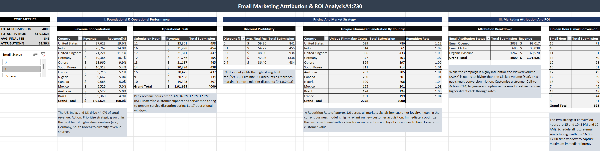
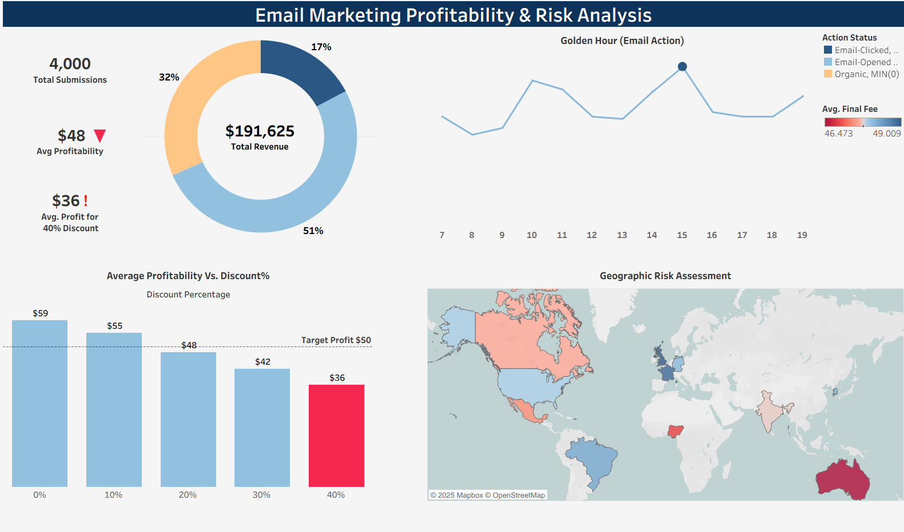

##  Email Marketing Profitability & Risk Dashboard

This project utilizes Tableau and Advanced Excel/Power Query to analyze **Email Marketing performance across the entire customer lifecycle**, focusing on profitability and retention. It delivered executive-level insights, successfully identifying the **40% discount tier** as a major profit leakage area and providing data-backed recommendations to optimize strategy.

***

###  Project Overview & Purpose

This dashboard was developed to solve a critical business problem regarding campaign profitability and allows executive stakeholders to:

* **Detect Profit Leakage:** Quantify and isolate underperforming discount tiers to protect margins.
* **Optimize Strategy:** Provide data-backed recommendations on pricing and email deployment strategy.
* **Monitor Performance:** Evaluate conversion, profit, and risk across customer segments and regions.

The final deliverable is an interactive **Tableau** dashboard, supported by a clean **Excel** data model.

***

###  Visual Analysis & Screenshots

#### 1. Excel Analysis Screenshot

#### 2. Tableau Dashboard Screenshot

***

###  Key Business Insights & Recommendations

The analysis identified key areas for immediate strategic action:

* **Profit Leakage Elimination:** Identified a critical issue in the **40% discount tier** (Avg. Profit $36 vs. $50 Target). **Recommendation:** Eliminate this tier to protect margins.
* **Conversion Optimization:** Submission Hour data revealed specific peak conversion times (11 AM, 4 PM, 5 PM). **Recommendation:** Optimize email send schedules to target these precise hours.
* **Regional Focus:** **United States** and **India** are the highest profitability regions. **Recommendation:** Focus expansion and marketing spend on these high-performing markets.

***

###  Tools & Techniques Used

The project pipeline involved: **Data Preparation** using Power Query (MS Excel) ; 
**Data Modeling** using Advanced Excel (Pivot Tables, XLOOKUP/VLOOKUP) to generate metrics;
**Visualization** in Tableau Desktop (Dual-Axis charts, customized KPIs);
**Version Control** via Git & GitHub.

***

### 📂 Repository Contents & Access

* **Tableau Dashboard:** `Email Marketing Profitability & Risk Analysis.twbx` (Interactive workbook).
* **Excel Data Model:** `email_marketing_excel.xlsx` (Cleaned data, lookups, and final analysis).
* **Live Dashboard Link:** [**View the Dashboard Live Here**](https://shorturl.at/ikTSE)
